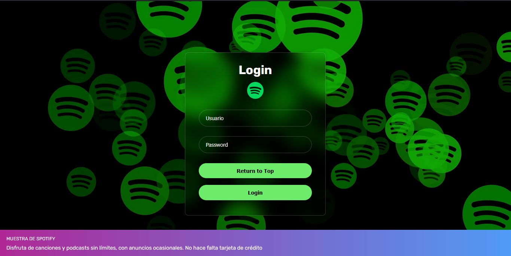
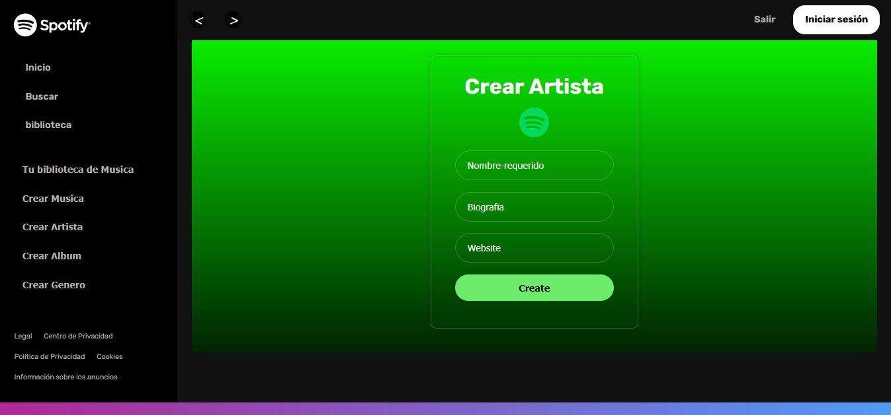

#   ""    Spotify    🎵🎶  ""

# Aplicacion de Musica con React Js, API (Python, Django), HTML, CSS, Bulma,

## **Documentación Técnica**

### **Introducción del Proyecto**
- **Breve descripción de la aplicación:**

Este documento describe el desarrollo de una aplicación web llamada "MUSICA".
La aplicación tiene como objetivo ofrecer una experiencia de usuario intuitiva para la gestión y exploración de canciones, artistas y álbumes. 
Está desarrollada en ReactJS y consume una API RESTful para la manipulación de datos.

### **Descripción del Proyecto**
La aplicación MUSICA permite a los usuarios explorar un catálogo de música, gestionar su perfil, y realizar operaciones CRUD sobre las canciones. 
Los usuarios autenticados pueden agregar, editar y eliminar canciones.
Además, la aplicación ofrece una interfaz de usuario moderna, con navegación intuitiva y segura mediante autenticación JWT.


### **Capturas de pantalla**




### **Guía de Instalación**
- **Requisitos previos**
  - React js
  - API 
  - Html
  - CSS
  - Bulma

### **Requerimientos del Proyecto**
-	Framework: ReactJS
-	Control de versiones: Git (Repositorio en GitHub)
-	Entorno de desarrollo: Local, desplegado en Vercel.
-	API: HarmonyHub (API proporcionada por la cátedra).
-	Autenticación: JWT.

### **Autenticación y Autorización**
-	JWT: La autenticación y manejo de sesiones se realiza mediante tokens JWT. Todas las solicitudes a la API están autenticadas.
-	Protección de rutas: Rutas protegidas para áreas que requieren autenticación, como la página de perfil.

### **Consumo de la API**
-	Operaciones CRUD: La aplicación interactúa con varios endpoints para crear, leer, actualizar y eliminar canciones.
-	Manejo de errores: Se implementan notificaciones visuales para informar al usuario sobre el estado de las operaciones, incluyendo mensajes de error.

### **Funcionalidades Implementadas**
- Registro e Inicio de Sesión
Los usuarios pueden registrarse y autenticarse mediante el formulario de inicio de sesión, que envía credenciales a la API para recibir un JWT.

- Exploración de Música
La página de inicio muestra una lista de canciones con la opción de ver detalles, editar o eliminar (si el usuario está autenticado).

- Gestión de Canciones
Los usuarios autenticados pueden agregar nuevas canciones, editar o eliminar las existentes. Las operaciones se realizan mediante formularios modales.

- Perfil de Usuario
La página de perfil muestra la información del usuario autenticado y permite modificar sus datos.

###  **Instrucciones de instalación**
 1. Clona el repositorios:
     ```bash
     git clone https://github.com/CJose98/Song_react.git #frontend

     cd Song_react
     ```
  2. Instala las dependencias:
     ```bash
     npm install
     ```
  3. Inicia la aplicación:
     ```bash
     npm run dev

### **Configuración del entorno**
Variebale de entorno: 
[`.env`](app/.env")
  ```env
 VITE_BASE_URL = https://sandbox.academiadevelopers.com

    user = 41180312
    password = TC5tQbgc4v
  ```


### **UI e Implementación de Componentes**
- Interfaz de Usuario: Se prioriza una UI funcional y fácil de usar.
-	Componentes React: Se utilizan hooks como useState, useEffect, y useContext para el manejo de estado.
-	Contexto: AuthContext es utilizado para compartir el estado de autenticación entre componentes.
-	Estilos: Se utilizó CSS puro para el diseño de la interfaz, con un enfoque en la simplicidad y la consistencia visual.

### **Enrutamiento**
-	React Router: Se implementaron rutas para las secciones principales de la aplicación:

-	/spotify     - Página de inicio con una lista de canciones.
-	/login       - Página de inicio de sesión.
-	/profile     - Página de perfil del usuario.
-	/            - Página principal de los datos
- /            - Página de detalles de una canción específica.
-	Rutas protegidas: Solo los usuarios autenticados pueden acceder a la página de perfil y realizar operaciones de edición y eliminación de canciones.
-	Página 404: Se incluye una página de error para rutas no encontradas.


### **Conclusión**
El proyecto MUSICA es una demostración del conocimiento adquirido durante el trascurso universitario, aplicando tecnologías modernas y mejores prácticas en el desarrollo web. Se alcanzaron todos los objetivos planteados, ofreciendo una aplicación funcional, segura y con una experiencia de usuario agradable.